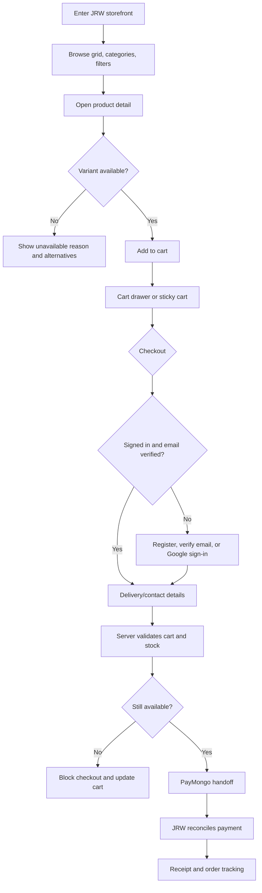
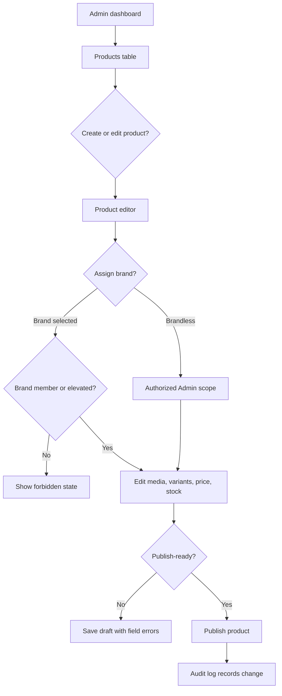
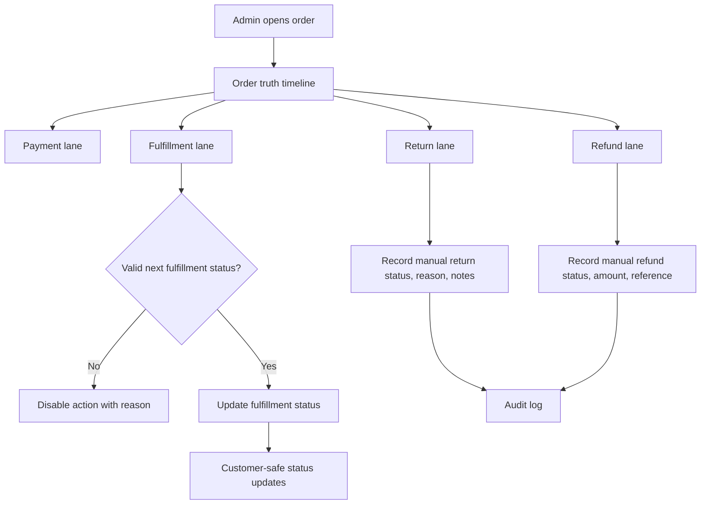
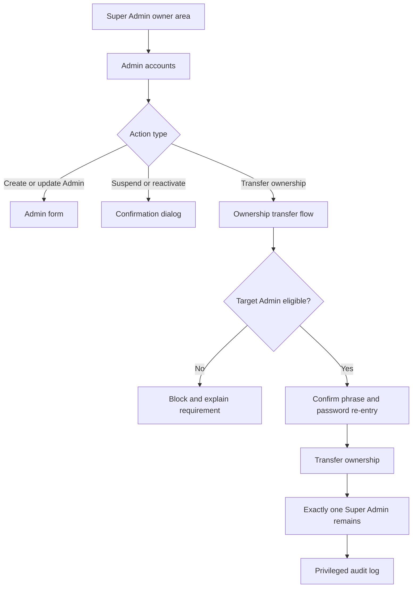

# UX Design Specification jrw-webapp

**Author:** MR. JRW
**Date:** 2026-05-11

---

<!-- UX design content will be appended sequentially through collaborative workflow steps -->

## Executive Summary

### Project Vision

JRW Webapp is a single-store ecommerce experience for JRW lifestyle products. UX must support two main surfaces: public customer storefront and internal admin command dashboard. Storefront must feel sharp, fast, trustworthy, and product-first. Admin dashboard must feel dense, controlled, and operational.

JRW is seller of record. Brands organize catalog collaboration only; they are not stores, sellers, or payment owners.

### Target Users

Prospects browse storefront without account and need fast product discovery.

Customers register, verify email or use Google sign-in, buy products through PayMongo, and track order status.

Admins manage catalog, brands, inventory, prices, orders, manual returns/refunds, and brand-scoped products.

Super Admin manages Admin accounts, ownership transfer, and owner-only controls.

### Key Design Challenges

- Keep storefront simple while product types expand beyond apparel.
- Make role boundaries obvious between Super Admin and Admin.
- Show brand collaboration without implying marketplace or multi-store model.
- Make checkout, payment status, fulfillment status, return, and refund states understandable.
- Preserve Technical Brutalist style without making customer shopping feel cold or hard.

### Design Opportunities

- Use Google Stitch architectural system as JRW identity: sharp 1px grid, Satoshi headings, Space Mono system text, cobalt accent, no shadows.
- Make admin dashboard feel like command center: tables, status bands, audit trails, fast actions.
- Make storefront feel premium and precise: modular product grid, strong images, clear availability, sharp checkout.
- Use brand pages and product labels as catalog clarity, not marketplace complexity.

## Core User Experience

### Defining Experience

Core JRW experience is two connected loops: customer browse-to-buy loop and admin operate-the-store loop.

Customer loop: browse lifestyle products, inspect details, choose variant, add to cart, verify identity when needed, pay through PayMongo, track order.

Admin loop: manage products, brands, inventory, prices, orders, returns/refunds, and audit activity from one precise dashboard.

Product succeeds when customer shopping feels fast and trustworthy, while admin work feels controlled and hard to misuse.

### Platform Strategy

JRW Webapp is web-first.

Customer storefront is responsive-first and optimized for both desktop web and mobile. Desktop users get rich product grids, filters, comparison-friendly scanning, strong product detail pages, keyboard/pointer states, and clear cart access. Mobile users get thumb-safe browsing, stable product cards, sticky cart actions, and compact checkout flow.

Checkout must keep feature parity across desktop and mobile: same cart, delivery/contact, payment, confirmation, and order tracking steps, with layout adapting to viewport.

Admin and Super Admin dashboards are desktop-first, table-driven, keyboard-friendly, and dense. Tablet support matters for catalog/order work, but dashboard complexity can prioritize desktop.

Offline mode is not MVP. Network failure states must be clear during checkout, payment reconciliation, image upload, and order updates.

### Effortless Interactions

- Prospect can browse products without account.
- Customer can move from product detail to cart without learning app structure.
- Checkout clearly separates cart, delivery/contact info, payment, and confirmation.
- Admin can create or update product/variant/stock/price from predictable forms.
- Admin can assign product to brand or leave brandless without confusion.
- Admin can update order fulfillment status using only valid next actions.
- Super Admin can see owner-only controls without mixing them into daily operations.
- Return/refund manual entry feels like order operations, not payment automation.

### Critical Success Moments

- Prospect sees JRW identity and product grid immediately.
- Product detail page makes price, variant, availability, and primary action obvious.
- Checkout blocks unavailable items before payment.
- Payment success reconciles from JRW server, not redirect trust alone.
- Customer sees safe order/payment/return/refund status labels.
- Admin publishes product with image, variant, price, and stock without database work.
- Brand member Admin can see and modify brand products.
- Super Admin transfers ownership with deliberate confirmation and audit trail.

### Experience Principles

1. **Responsive storefront parity**
   Desktop and mobile storefronts both feel first-class. Layout changes, capability does not.

2. **Product-first precision**
   Products, prices, variants, and availability lead. Interface stays sharp and quiet.

3. **Role clarity everywhere**
   Customer, Admin, and Super Admin surfaces must never feel interchangeable.

4. **Valid actions only**
   Hide, disable, or explain unavailable actions before user hits domain errors.

5. **Status truth**
   Payment, fulfillment, return, and refund statuses stay separate but understandable.

6. **Architectural identity**
   1px grid, sharp corners, no shadows, Satoshi headings, Space Mono utility text, cobalt accent used sparingly.

7. **Operational density**
   Dashboard screens favor scanning, filters, tables, and fast edits over marketing-style layouts.

## Desired Emotional Response

### Primary Emotional Goals

JRW should make customers feel certain, stylish, and safe. Storefront should feel premium but not fragile: products look curated, prices and stock feel honest, checkout feels controlled.

Admins should feel command and clarity. Dashboard should reduce guessing by showing current state, valid next actions, and audit trail.

Super Admin should feel deliberate authority. Owner actions should feel powerful, narrow, and hard to trigger accidentally.

### Emotional Journey Mapping

Prospect first visit: immediate recognition of JRW identity, sharp product grid, clear categories, no account wall.

Product browsing: curiosity and confidence. Product images, variants, price, and availability answer questions before checkout.

Checkout: calm focus. Customer sees cart, delivery/contact details, PayMongo payment handoff, and order confirmation without hidden state.

Order tracking: trust. Customer sees safe labels for payment, fulfillment, return, and refund status.

Admin daily work: control. Admin sees products, brands, stock, orders, and actions in predictable dashboard surfaces.

Super Admin governance: seriousness. Admin creation, suspension, and ownership transfer feel audit-safe.

Failure/recovery: handled. Errors show what happened, what remains safe, and next action.

### Micro-Emotions

- Confidence over confusion: labels, statuses, and next actions stay explicit.
- Trust over skepticism: payment/order states reconcile from JRW and avoid provider jargon.
- Control over anxiety: admin dashboard shows only allowed actions.
- Precision over clutter: sharp grid and dense layout communicate discipline.
- Safety over surprise: ownership transfer, refund/return records, and destructive actions require confirmation.
- Momentum over friction: storefront browsing and admin edits avoid unnecessary steps.

### Design Implications

- Use strong product imagery and stable grid layout on both desktop and mobile.
- Keep account prompts out of browsing; ask for identity only when needed.
- Keep cart and checkout progress visible.
- Use status badges with text labels, timestamps, and safe explanations.
- Use desktop dashboard tables, filters, side panels, and confirmation dialogs.
- Use 1px borders, no shadows, square corners, and restrained cobalt accent for focus.
- Use plain recovery states for payment failure, unavailable inventory, invalid role access, upload failure, and webhook reconciliation delay.

### Emotional Design Principles

1. **Confidence is layout**
   Users should know where they are, what changed, and what action is allowed.

2. **Premium without softness**
   JRW feels curated through structure, typography, imagery, and restraint, not decoration.

3. **Trust is visible state**
   Payment, order, return, and refund states need clear labels and timestamps.

4. **Authority needs friction**
   Admin suspension, refund/return records, and ownership transfer require deliberate confirmation.

5. **Recovery stays calm**
   Failed actions explain cause and next step without exposing internals.

## UX Pattern Analysis & Inspiration

### Inspiring Products Analysis

**Google Stitch architectural system**

Best source for JRW visual identity. Sharp 1px grid, square corners, high contrast, Satoshi identity type, Space Mono system labels, no shadows, cobalt accent.

Adopt structure and discipline. Avoid making it too cold for shopping by pairing system layout with strong product imagery.

**Old JRW Simple E-commerce reference**

Useful flow memory:
- Discovery: landing to product grid to product preview/detail.
- Checkout: cart drawer, delivery/contact form, PayMongo handoff, receipt-style success.
- Admin: dashboard overview, table row drill-in, status update, email notification.

Keep these flows, but update scope: lifestyle products, brands as catalog groups, manual return/refund records, single JRW seller.

**Shopify-style admin patterns**

Useful for catalog operations: searchable product tables, filter chips, bulk actions, side-panel editing, inventory status, order timelines.

Adapt for JRW by keeping dashboard narrower and more command-like. No generic merchant marketplace language.

**Premium lifestyle storefront patterns**

Useful for customer experience: strong product imagery, category-led discovery, desktop product-grid density, mobile sticky cart, product detail pages with clear variants and availability.

Adapt without soft luxury visuals. JRW stays technical, precise, and architectural.

**Linear-style operational surfaces**

Useful for admin dashboard tone: dense lists, fast filters, status badges, keyboard-aware actions, clean empty states.

Adapt for orders, inventory, brands, audit logs, and owner controls.

### Transferable UX Patterns

- Modular product grid for storefront discovery on desktop and mobile.
- Product detail side panel or full page depending viewport and product complexity.
- Cart drawer on desktop; sticky cart/action bar on mobile.
- Step-based checkout: cart, contact/delivery, payment, confirmation.
- Receipt-style order confirmation using Space Mono.
- Admin dashboard shell with sidebar, top context bar, and table-first work areas.
- Product editor with sections for identity, media, variants, inventory, pricing, brand, status.
- Order detail timeline separating payment, fulfillment, return, and refund events.
- Brand membership view showing members, pending invites, and brand-scoped products.
- Confirmation dialogs for ownership transfer, suspension, archive, refund/return records.

### Anti-Patterns to Avoid

- Treating brands like stores, sellers, tenants, or PayMongo owners.
- Hiding storefront behind account registration.
- Mobile-only storefront thinking; desktop must also feel first-class.
- Dashboard cards everywhere instead of tables and focused work surfaces.
- Mixing Super Admin owner controls into normal Admin catalog workflows.
- Combining payment status and fulfillment status into one vague order label.
- Showing provider errors or webhook details to customers.
- Using rounded, soft, shadow-heavy ecommerce UI that conflicts with JRW identity.
- Letting decorative grid lines reduce readability.
- Making manual returns/refunds look like automated PayMongo refunds.

### Design Inspiration Strategy

**Adopt**
- Google Stitch sharp grid, typography, cobalt accent, no-shadow structure.
- Old JRW discovery, cart, PayMongo, receipt, and admin command flow.
- Shopify-like catalog/order information architecture.
- Linear-like admin density and status clarity.

**Adapt**
- Lifestyle storefront patterns into technical brutalist storefront.
- Product previews into responsive desktop side panels and mobile full-screen sheets.
- Admin CRUD flows into brand-aware, role-aware operations.
- Order timelines into separate lanes for payment, fulfillment, return, and refund truth.

**Avoid**
- Marketplace mental model.
- Soft generic ecommerce theme.
- Promo-heavy shopping clutter.
- Overly sparse admin pages.
- Any UI that hides status truth or role boundaries.

## Design System Foundation

### 1.1 Design System Choice

JRW should use a custom design system built from local React UI primitives and Tailwind CSS tokens, guided by `docs/design-by-google-stitch.md`.

Do not adopt a full external component system as primary UI. JRW needs a precise branded storefront plus dense admin dashboard, and generic component libraries will fight the sharp 1px architectural identity.

### Rationale for Selection

Custom system fits JRW because:

- Existing Stitch reference already defines strong tokens: sharp corners, 1px borders, no shadows, Satoshi, Space Mono, cobalt accent.
- Storefront needs first-class desktop and mobile layouts, not generic ecommerce templates.
- Admin dashboard needs table-first operational density with role and status precision.
- Super Admin controls need deliberate, audit-safe patterns.
- Product identity matters enough that visual uniqueness is worth higher initial setup.
- Local primitives keep accessibility, status language, loading, and error states consistent across storefront and dashboard.

### Implementation Approach

Use token-driven primitives first:

- `Button`
- `IconButton`
- `Input`
- `Textarea`
- `Select`
- `Checkbox`
- `Toggle`
- `Badge`
- `StatusBadge`
- `Tabs`
- `SegmentedControl`
- `DataTable`
- `Modal`
- `Drawer`
- `SidePanel`
- `Toast`
- `ConfirmDialog`
- `EmptyState`
- `Skeleton`
- `Pagination`
- `Stepper`

Build feature components from primitives:

- `ProductCard`
- `ProductGrid`
- `ProductDetailPanel`
- `CartDrawer`
- `CheckoutSteps`
- `OrderReceipt`
- `OrderTimeline`
- `DashboardShell`
- `ProductEditor`
- `VariantMatrix`
- `InventoryAdjuster`
- `BrandMemberTable`
- `OrderStatusPanel`
- `ReturnRefundRecorder`
- `OwnershipTransferDialog`

### Customization Strategy

Visual rules:

- 0px radius for all components.
- 1px borders define modules and spacing.
- No shadows, no blur, no soft gradient decoration.
- Cobalt accent only for focus, selected state, primary action, and live status.
- Black/white/grey surfaces carry most UI.
- Strong product imagery warms storefront without breaking technical identity.
- Status badges use text plus color; never color alone.

Layout rules:

- Storefront uses modular grid with desktop and mobile parity.
- Dashboard uses fixed sidebar, top context bar, dense tables, filters, and side panels.
- Checkout adapts from desktop split layout to mobile stacked flow.
- Product editor uses sectioned form modules.
- Order detail uses timeline structure separating payment, fulfillment, return, and refund.

## 2. Core User Experience

### 2.1 Defining Experience

Defining JRW experience is: choose product confidently, buy safely, operate catalog precisely.

For customers, core action is product confidence. They can scan a sharp product grid, open detail, understand variant, price, stock, and delivery implication, then add to cart without doubt.

For Admins, core action is operational control. They can update catalog, stock, brand, price, order, and manual return/refund state from focused dashboard surfaces where only valid actions appear.

### 2.2 User Mental Model

Prospects think like shoppers: "Show me what JRW sells, what is available, how much it costs, and why I should trust it."

Customers think in checkout stages: cart, details, payment, confirmation, status.

Admins think in operations: product exists, stock changes, price changes, order moves, exception gets recorded.

Super Admin thinks in governance: who can operate JRW, who owns platform authority, what changed, and who did it.

Likely confusion points:
- Brand mistaken as seller/store.
- Product unavailable after cart add.
- Payment success but order status unclear.
- Return/refund manual record mistaken as automated refund.
- Super Admin controls mistaken as normal admin tools.

### 2.3 Success Criteria

Core experience succeeds when:

- Product grid makes category, brand, price, stock, and product identity scannable.
- Product detail answers variant, image, price, availability, and next action without extra navigation.
- Cart and checkout preserve user confidence across desktop and mobile.
- Checkout blocks unavailable variants before PayMongo handoff.
- Order status separates payment, fulfillment, return, and refund states.
- Admin product editor allows publish-ready product without database work.
- Brand assignment is optional and clearly catalog-only.
- Admin order screen shows valid status actions and exception recording.
- Super Admin ownership transfer requires confirmation and produces audit trail.

### 2.4 Novel UX Patterns

JRW mostly uses established ecommerce and admin patterns, with a distinct visual system.

Established:
- Product grid
- Product detail page/panel
- Cart drawer
- Checkout steps
- Order timeline
- Admin tables
- Side-panel editors
- Confirmation dialogs

JRW-specific twist:
- Technical Brutalist storefront instead of soft ecommerce UI.
- Brands as collaboration/catalog groups, not sellers.
- Order detail timeline split into payment, fulfillment, return, and refund truth.
- Manual return/refund recorder integrated into order operations.
- Super Admin ownership transfer as narrow governance workflow.

### 2.5 Experience Mechanics

**Customer product confidence flow**

1. Initiation: Prospect lands on storefront and sees JRW identity, categories, product grid, filters, cart access.
2. Interaction: User filters, opens product, inspects images/variants/availability, adds item to cart.
3. Feedback: Cart count updates, unavailable states explain why action is blocked, price and stock remain visible.
4. Completion: Customer proceeds to checkout, pays through PayMongo, lands on JRW confirmation/status.

**Admin operational control flow**

1. Initiation: Admin lands on dashboard with inventory/order/catalog context.
2. Interaction: Admin opens table row or create action, edits product/stock/order state in side panel.
3. Feedback: Form validates inline, save state is visible, audit activity records important changes.
4. Completion: Product publishes, stock updates, order moves, or return/refund record attaches to order.

**Super Admin governance flow**

1. Initiation: Super Admin enters owner-only area.
2. Interaction: Creates/suspends Admin or begins ownership transfer.
3. Feedback: System shows consequence, confirmation, and role impact.
4. Completion: Ownership/admin change completes with audit trail and exactly one owner.

## Visual Design Foundation

### Color System

JRW uses existing Google Stitch palette as brand foundation.

Core tokens:
- Surface: `#FFFFFF`
- Background: `#FCF8F9`
- Content: `#0D1117`
- Muted content: `#45474B`
- Border/support: `#E1E4E8`
- Strong border: `#0D1117`
- Primary action/accent: `#3E96F4`
- Error: `#BA1A1A`

Semantic mapping:
- Primary: black or cobalt depending action weight.
- Secondary: white with black border.
- Selected/focus/live: cobalt.
- Success: text-first green status token, used sparingly.
- Warning: amber status token, text label required.
- Error/destructive: red status token, confirmation required.
- Disabled: muted surface plus muted content.

Storefront remains mostly black, white, grey, and product imagery. Cobalt marks action and system state, not decoration.

### Typography System

Use Stitch typography as default:

- Logo/identity: Satoshi Bold.
- Headings: Satoshi Bold.
- Body/system text: Space Mono.
- Labels/status/data: Space Mono.
- Numeric/order/payment data: Space Mono with tabular alignment where supported.

Typography roles:
- Storefront headings can use Satoshi for product identity and category impact.
- Storefront product metadata uses Space Mono for price, SKU, status, and variant details.
- Admin dashboard uses Space Mono heavily for tables, filters, timestamps, audit events, and status.
- Body copy stays short; UI should not depend on long explanatory prose.

Type scale:
- Display/H1: 48px desktop, responsive down to 32px mobile.
- H2: 32px desktop, 24px mobile.
- H3: 20px.
- Body: 14px-16px.
- Label/code: 11px-12px.
- No viewport-based font scaling.

### Spacing & Layout Foundation

Base spacing uses 4px system.

Spacing tokens:
- `xs`: 8px
- `sm`: 16px
- `md`: 24px
- `lg`: 48px
- `xl`: 80px
- grid gutter: 1px border

Layout rules:
- Use 12-column modular grid on desktop storefront.
- Use 2-4 column product grid on tablet based on width.
- Use 1-2 column product grid on mobile depending product card density.
- Dashboard uses fixed sidebar, top bar, table work area, side panel editor.
- Modules align to 1px grid lines.
- Use borders as structure, not shadows.
- Cards are modules, not floating rounded containers.
- Keep stable dimensions for product cards, action bars, tables, tabs, status badges, and counters.

### Accessibility Considerations

- Meet WCAG 2.2 AA contrast for text and controls.
- Touch targets at least 44px on storefront and checkout.
- Cobalt focus ring or border must be visible against white and grey surfaces.
- Status never relies on color alone; always include text label.
- Inputs always show visible labels.
- Errors appear near fields and summarize at form top where needed.
- Modals, drawers, and side panels trap focus and restore focus on close.
- Keyboard access required for product grid, cart, checkout, dashboard tables, order actions, and owner controls.
- Motion respects `prefers-reduced-motion`.

## Design Direction Decision

### Design Directions Explored

Seven directions were explored in `_bmad-output/planning-artifacts/ux-design-directions.html`:

1. Storefront Grid: desktop and mobile product discovery using modular 1px grid.
2. Product Detail System: product inspection, variants, availability, cart drawer.
3. Mobile Commerce Parity: mobile storefront with same capability as desktop.
4. Precision Checkout: cart, delivery/contact, PayMongo handoff, receipt/status.
5. Admin Catalog Console: table-first catalog and inventory operations.
6. Order Truth Timeline: separate payment, fulfillment, return, and refund state.
7. Super Admin Governance: owner-only admin management and ownership transfer.

### Chosen Direction

Use combined direction: **Architectural Commerce System**.

Base:
- Direction 01 for storefront product discovery.
- Direction 02 for product detail and cart behavior.
- Direction 04 for checkout.
- Direction 05 for admin dashboard.
- Direction 06 for order detail truth.
- Direction 07 for Super Admin governance.
- Direction 03 as mobile adaptation rule, not separate product.

### Design Rationale

This combined direction fits JRW because it preserves Stitch identity while covering both commerce and operations.

Storefront becomes premium and precise without becoming cold. Dashboard becomes dense and safe without becoming generic. Checkout and order views make status truth visible. Brand collaboration remains catalog language, not marketplace language.

### Implementation Approach

Implement direction as one system:

- Shared tokens: color, type, spacing, border, focus, status.
- Shared primitives: buttons, inputs, badges, tables, drawers, modals, confirmations.
- Storefront layouts: modular product grid, product detail, cart drawer, mobile sticky cart.
- Checkout layouts: staged flow, payment handoff, receipt/status view.
- Dashboard layouts: sidebar, top context bar, tables, filters, side panels.
- Order layouts: timeline split by payment, fulfillment, return, refund.
- Governance layouts: owner-only pages with confirmation and audit trail.

## User Journey Flows

### Prospect To Customer Purchase

Prospect browses first, account comes later only when checkout needs identity.

### Admin Catalog And Brand Work

Admin can work brandless or inside brand scope. Brand never means seller/store.

### Order Operations, Return, Refund

Order detail separates payment, fulfillment, return, refund.

### Super Admin Governance

Owner controls stay narrow and deliberate.

### Journey Patterns

- Browse before account.
- Validate before payment.
- Show only valid next actions.
- Separate status lanes instead of vague order state.
- Use side panels for admin editing.
- Use confirmation for destructive or authority-changing actions.
- Record audit trail after sensitive changes.

### Flow Optimization Principles

- Storefront keeps desktop and mobile feature parity.
- Checkout blocks bad state before PayMongo handoff.
- Admin tables lead to focused side-panel work.
- Brand language stays catalog/collaboration only.
- Customer errors stay safe and non-technical.
- Super Admin actions require deliberate friction.

## Component Strategy

### Design System Components

Foundation primitives:

- Button / IconButton
- Input / Textarea / Select
- Checkbox / Toggle
- Badge / StatusBadge
- Tabs / SegmentedControl
- DataTable
- Modal / Drawer / SidePanel
- Toast / ConfirmDialog
- EmptyState / Skeleton
- Pagination / Stepper

All primitives use JRW tokens: 0px radius, 1px borders, no shadows, visible focus, text-first status.

### Custom Components

### ProductCard

**Purpose:** Show product identity, image, price, brand/category, and availability.

**Usage:** Storefront grid, related products, admin product previews.

**Anatomy:** Image module, product name, brand/category, price, availability badge, quick action.

**States:** Default, hover/focus, loading image, out of stock, low stock, preorder, archived admin-only.

**Accessibility:** Product link has clear label. Availability is text, not color only.

### ProductDetailPanel

**Purpose:** Help customer inspect product and select valid variant.

**Usage:** Desktop side panel or product page; mobile full-screen sheet/page.

**Anatomy:** Gallery, product heading, brand/category, price, description, variants, stock, add-to-cart.

**States:** Loading, available, unavailable variant, cart pending, error.

**Accessibility:** Variant buttons keyboard accessible and announce selected/unavailable state.

### CartDrawer

**Purpose:** Keep cart review close to browsing on desktop.

**Usage:** Storefront cart and checkout entry.

**Anatomy:** Line items, quantities, price, stock warnings, subtotal, checkout action.

**States:** Empty, active, stale inventory, updating quantity, checkout blocked.

**Accessibility:** Drawer traps focus and returns focus on close.

### CheckoutSteps

**Purpose:** Show progress through cart, contact/delivery, payment, confirmation.

**Usage:** Checkout flow desktop and mobile.

**Anatomy:** Step labels, current step, completed steps, safe error summary.

**States:** Current, complete, blocked, payment pending, payment failed.

**Accessibility:** Current step exposed as text and aria-current.

### OrderReceipt

**Purpose:** Confirm successful checkout and show trackable order summary.

**Usage:** Post-payment confirmation.

**Anatomy:** Order number, items, totals, payment status, fulfillment status, next action.

**States:** Payment pending, paid, failed, reconciliation delayed.

**Accessibility:** Receipt content structured as readable summary.

### OrderTimeline

**Purpose:** Customer-safe order status tracking.

**Usage:** Customer order detail/status page.

**Anatomy:** Payment, fulfillment, return, refund status lanes; timestamps; safe labels.

**States:** Pending, paid, failed, processing, shipped, delivered, return/refund requested/completed.

**Accessibility:** Status lanes readable without color.

### DashboardShell

**Purpose:** Standard admin workspace.

**Usage:** Admin and Super Admin areas.

**Anatomy:** Sidebar, top context bar, role badge, content area, action region.

**States:** Admin scope, Super Admin scope, forbidden, loading.

**Accessibility:** Skip link, keyboard navigation, landmark structure.

### ProductEditor

**Purpose:** Create/edit publish-ready product.

**Usage:** Admin catalog side panel or page.

**Anatomy:** Identity, media, brand, categories, variants, pricing, stock, publish status.

**States:** Draft, dirty, saving, validation error, publish blocked, saved.

**Accessibility:** Field labels, error summary, keyboard-save support.

### VariantMatrix

**Purpose:** Manage product variants and stock/prices efficiently.

**Usage:** Product editor.

**Anatomy:** Variant rows, SKU/options, price, stock, status, bulk actions.

**States:** Empty, valid, duplicate option, low stock, archived.

**Accessibility:** Table semantics and keyboard row actions.

### OrderStatusPanel

**Purpose:** Admin order state control.

**Usage:** Order detail page/panel.

**Anatomy:** Payment lane, fulfillment lane, return lane, refund lane, valid next actions.

**States:** Valid next action, disabled action with reason, pending update, conflict rollback.

**Accessibility:** Disabled actions explain why.

### ReturnRefundRecorder

**Purpose:** Record manual return/refund information without implying automated refund.

**Usage:** Order detail.

**Anatomy:** Type, status, amount, reason, notes, reference ID, actor, timestamp.

**States:** Not requested, requested, approved, rejected, received/completed, validation error.

**Accessibility:** Clear labels and confirmation before saving sensitive records.

### OwnershipTransferDialog

**Purpose:** Transfer Super Admin ownership while preserving exactly one owner.

**Usage:** Super Admin governance.

**Anatomy:** Target Admin, eligibility check, consequences, confirmation phrase, password re-entry, final action.

**States:** Ineligible target, ready, confirming, failed, complete.

**Accessibility:** Modal focus trap, clear destructive/action wording.

### Component Implementation Strategy

- Build primitives first.
- Build storefront components second.
- Build checkout/order status components before PayMongo UI work.
- Build admin dashboard shell before feature tables.
- Keep feature components close to feature modules.
- Keep primitives generic and token-driven.
- Keep business-rule explanations in feature components, not primitive UI.

### Implementation Roadmap

Phase 1: Primitives and layout shell  
Button, inputs, badges, table, modal, drawer, side panel, toast, confirm dialog, dashboard shell.

Phase 2: Storefront  
ProductCard, ProductGrid, ProductDetailPanel, CartDrawer, mobile sticky cart.

Phase 3: Checkout and customer order  
CheckoutSteps, OrderReceipt, OrderTimeline.

Phase 4: Admin catalog and brands  
ProductEditor, VariantMatrix, InventoryAdjuster, BrandMemberTable.

Phase 5: Order operations and governance  
OrderStatusPanel, ReturnRefundRecorder, AuditTimeline, OwnershipTransferDialog.

## UX Consistency Patterns

### Button Hierarchy

Primary buttons trigger main next action:
- Storefront: Add to Cart, Checkout, Continue to PayMongo.
- Customer: Verify Email, Track Order.
- Admin: Save Product, Publish Product, Update Order.
- Super Admin: Create Admin, Begin Ownership Transfer.

Secondary buttons support navigation or low-risk alternatives:
- Continue Shopping, View Details, Save Draft, Cancel, Back.

Danger buttons handle destructive or authority-changing actions:
- Suspend Admin, Archive Product, Reject Return, Transfer Ownership final confirmation.

Icon buttons only for compact repeated tools: search, filter, edit, close, upload, copy, print. Every icon button needs tooltip and accessible label.

### Feedback Patterns

Success:
- Use toast for routine saves.
- Use inline confirmation for checkout, payment, ownership transfer, and return/refund records.

Error:
- Field errors appear beside fields.
- Form-level error summary appears at top.
- Customer errors hide internals and show next action.
- Admin errors include request ID when safe.

Warning:
- Show before irreversible or high-impact action.
- Include consequence and required confirmation.

Loading:
- Button loading for actions.
- Skeletons for product grid, tables, order timeline.
- Stable dimensions; loading must not shift layout.

Conflict:
- For stale inventory, update cart and explain item changed.
- For invalid order transition, rollback UI and show allowed next status.

### Form Patterns

All forms:
- Visible labels.
- Required fields marked.
- Inline errors.
- Error summary for multi-field forms.
- Save button stable width.
- Dirty-state protection for admin editors.

Storefront forms:
- Short, checkout-focused.
- Delivery/contact fields grouped by address logic.
- Email verification prompts appear only when needed.

Admin forms:
- Sectioned modules: identity, media, brand, categories, variants, pricing, inventory, status.
- Brand field must say catalog group, not seller/store.
- Publish action blocked until required fields valid.

Sensitive forms:
- Suspension, ownership transfer, manual refund/return records need confirmation.
- Ownership transfer requires target eligibility, confirmation phrase, and password re-entry.

### Navigation Patterns

Storefront:
- Header contains logo, categories/search, cart, account.
- Desktop supports rich grid filters.
- Mobile supports compact category/filter controls and sticky cart.
- No account wall before browsing.

Customer account:
- Orders, profile, email verification, sign out.
- Keep account navigation shallow.

Admin:
- Sidebar: Dashboard, Products, Brands, Inventory, Orders, Customers, Audit, Settings.
- Top context bar: role, active brand scope, search/action area.
- Tables lead to side panels or detail pages.

Super Admin:
- Separate owner-only nav group: Admin Accounts, Ownership Transfer, Audit.
- Owner controls visually distinct from normal Admin catalog work.

### Modal And Overlay Patterns

Drawers:
- Cart drawer desktop.
- Admin side panels for product/order edits.

Mobile sheets:
- Product detail, filters, cart summary when space constrained.

Modals:
- Confirmation, ownership transfer, manual return/refund, image preview.

Rules:
- Trap focus.
- Restore focus on close.
- Escape/back closes non-destructive overlays.
- Destructive dialogs require explicit action.

### Empty, Loading, And Recovery Patterns

Empty states:
- No products: prompt Admin to create first product.
- No brands: explain brand optional.
- No orders: show waiting state.
- No audit events: explain events appear after sensitive changes.
- Empty storefront category: show alternatives.

Recovery:
- Payment failed: let customer retry or return to cart.
- Payment pending: show reconciliation message and order status.
- Inventory unavailable: update affected line item.
- Forbidden: explain role or brand membership requirement.
- Upload failed: retain form data and allow retry.
- Provider unavailable: safe message plus request ID where useful.

### Additional Patterns

Status labels:
- Payment: Pending, Paid, Failed, Cancelled, Refunded.
- Fulfillment: Placed, Processing, Ready to Ship, Shipped, Delivered, Cancelled, Refunded.
- Return: Not Requested, Requested, Approved, Rejected, Received.
- Refund: Not Requested, Requested, Approved, Rejected, Completed.

Status and heading rhythm:
- Badges/status labels above titles must have at least 12px bottom spacing.
- Titles above descriptive copy must have at least 16px bottom spacing in dashboard cards, timelines, panels, and governance modules.
- Badge, title, and copy must not appear visually glued even in dense admin surfaces.

Brand language:
- Use "brand", "catalog group", "brand members".
- Never use seller, merchant, tenant, store owner, payout owner.

Audit language:
- Always show actor, action, target, timestamp, request ID when safe.

## Responsive Design & Accessibility

### Responsive Strategy

Storefront is responsive-first with desktop and mobile parity.

Desktop storefront:
- 12-column product grid system.
- Rich filters, search, cart drawer, product detail side panel or full detail page.
- More visible product metadata without clutter.
- Keyboard and pointer hover/focus states.

Tablet storefront:
- 2-4 column product grid.
- Touch-safe filters and cart.
- Product detail can use full page or wide sheet based on viewport.

Mobile storefront:
- 1-2 column product grid.
- Compact category/filter controls.
- Sticky cart/action area.
- Product detail as full page or full-screen sheet.
- Checkout uses stacked steps.

Admin dashboard:
- Desktop-first for dense tables, filters, side panels, and audit views.
- Tablet usable for catalog/order operations.
- Mobile admin support may be read-first or limited, not primary MVP work surface.

Super Admin:
- Desktop-first. Ownership transfer and admin governance require stable, spacious layout.

### Breakpoint Strategy

Use mobile-up breakpoints:

- Small mobile: 320px-479px.
- Large mobile: 480px-767px.
- Tablet: 768px-1023px.
- Desktop: 1024px-1439px.
- Wide desktop: 1440px+.

Rules:
- Storefront must be fully usable from 320px.
- Storefront desktop must not feel like stretched mobile.
- Dashboard tables may collapse to row cards on tablet when needed.
- Admin side panels become full-screen panels on narrow viewports.
- Fixed-format UI must use stable dimensions to avoid layout shift.

### Accessibility Strategy

Target WCAG 2.2 AA.

Requirements:
- Text contrast meets AA.
- Touch targets at least 44px on storefront, checkout, and mobile controls.
- Visible focus indicator for every interactive element.
- Keyboard access for product grid, filters, cart, checkout, dashboard tables, forms, dialogs, and order actions.
- Status never relies on color alone.
- Inputs have visible labels and associated errors.
- Modals, drawers, and side panels trap focus and restore focus on close.
- Reduced motion respected.
- Customer-safe error messages avoid provider/internal details.

### Testing Strategy

Responsive testing:
- Test storefront at 320, 375, 390, 430, 768, 1024, 1440px.
- Test checkout at mobile, tablet, desktop.
- Test dashboard at tablet, desktop, wide desktop.
- Verify sticky cart/action bars do not cover content.
- Verify product cards, badges, buttons, titles, and tables do not overflow.

Accessibility testing:
- Automated axe or equivalent scan for core pages.
- Keyboard-only walkthrough for storefront, checkout, admin product editor, order detail, ownership transfer.
- Screen reader spot check for status labels, errors, dialogs, drawers.
- Contrast check for all status badges.
- Reduced-motion check for drawer/panel transitions.

Performance UX testing:
- Storefront usable load under 2.5s p75 target.
- Product images sized to target.
- Checkout feedback visible within 300ms.
- Admin mutation feedback visible within 300ms.

### Implementation Guidelines

- Use semantic HTML first.
- Use ARIA only where native semantics are not enough.
- Avoid viewport-based font scaling.
- Use responsive grids with explicit min/max sizing.
- Define stable dimensions for product cards, counters, badges, tabs, tables, panels, and action bars.
- Keep text from overflowing buttons, badges, cards, and table cells.
- Use `prefers-reduced-motion`.
- Use focus management in Modal, Drawer, SidePanel.
- Keep admin dense but never cramped: badge-to-title spacing and title-to-copy spacing are required.
