# API File Flow

## General File Flow

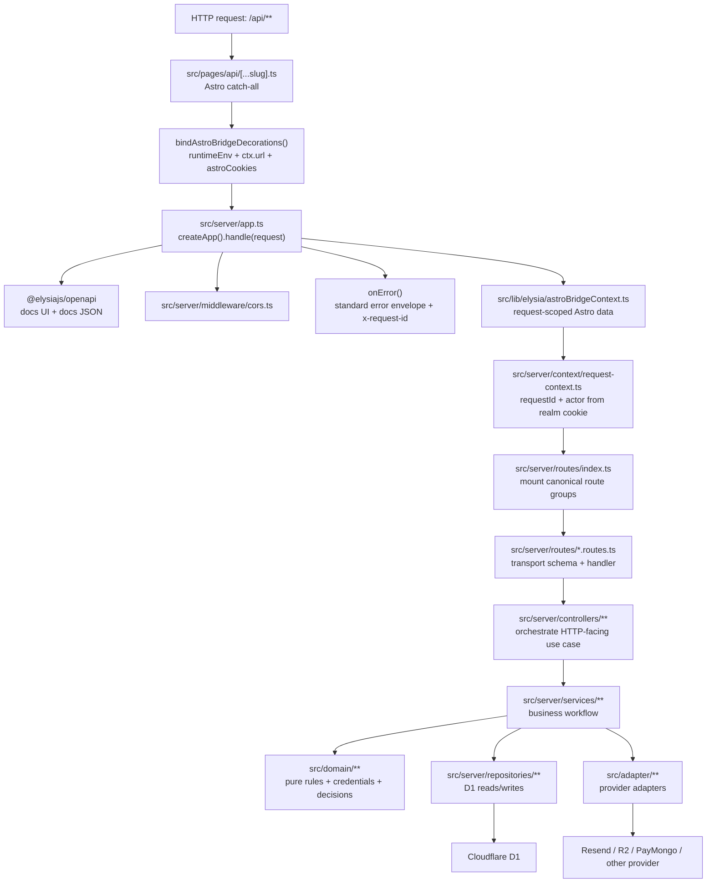

Debug order:

1. `src/pages/api/[...slug].ts`
2. `src/server/app.ts`
3. `src/server/context/request-context.ts`
4. `src/server/routes/index.ts`
5. `src/server/routes/<group>.routes.ts`
6. `src/server/controllers/<Thing>Controller.ts`
7. `src/server/services/<Thing>Service.ts`
8. `src/domain/**`
9. `src/server/repositories/**` or `src/adapter/**`

Notes:

- Active backend source of truth: `src/server/**`.
- Planned endpoint source: `_bmad-output/implementation-artifacts/1-3-api-endpoint-catalog.md`.
- Deprecated brownfield route tree intentionally excluded here.

## Active Endpoint Flows

### GET /api/

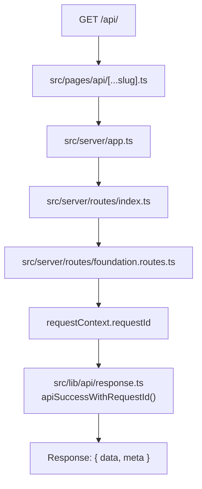

### GET /api/openapi and GET /api/openapi/json

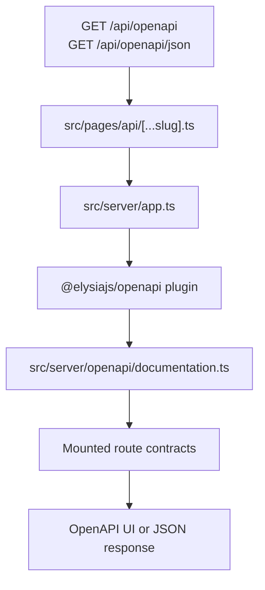

### Realm-Specific Email/Password Auth

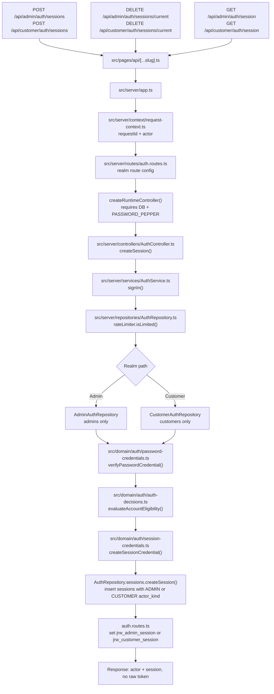

### Realm-Specific Session Delete/Inspect

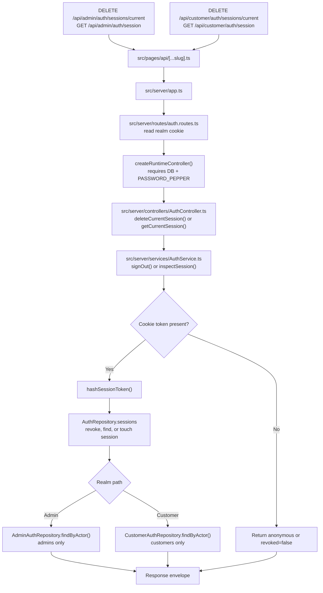

### Realm-Specific Password Recovery

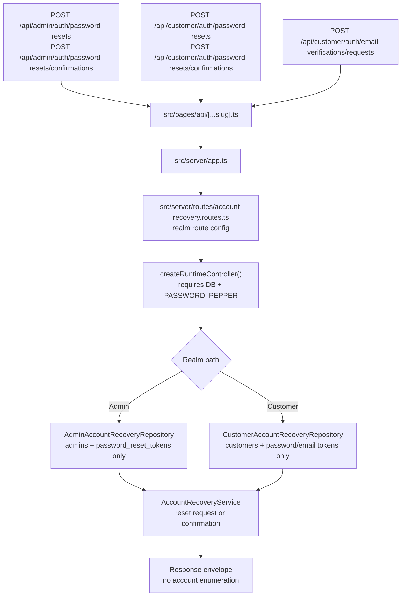

### Google OAuth Customer Sign-In

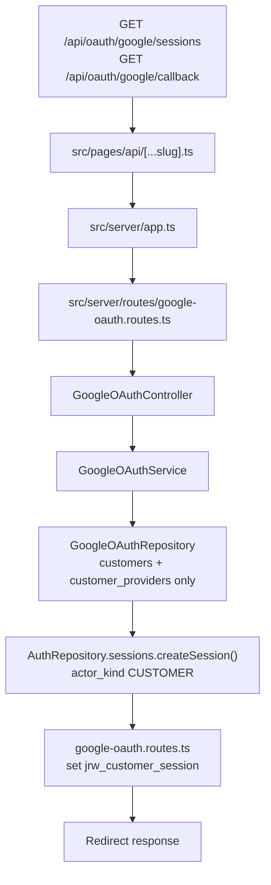

### POST /api/customers

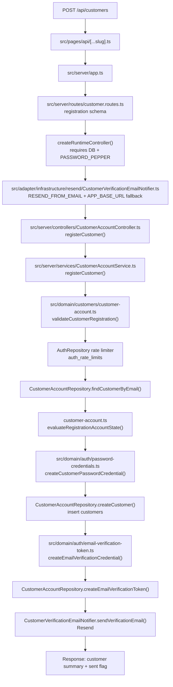

### POST /api/email-verifications

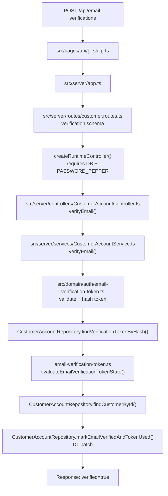

### GET /api/customers/me

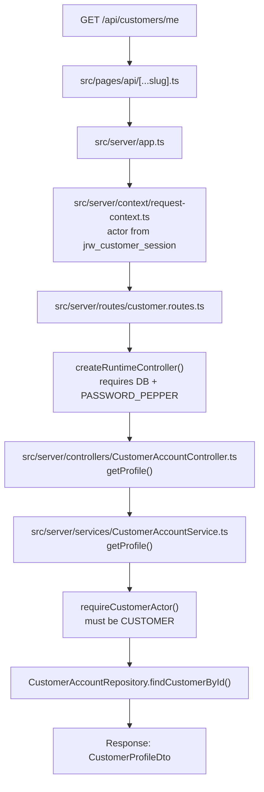

### PATCH /api/customers/me

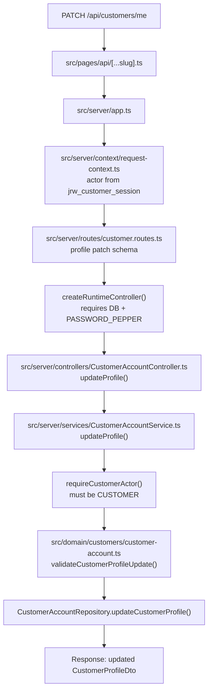

### Unknown /api/\*\* Route

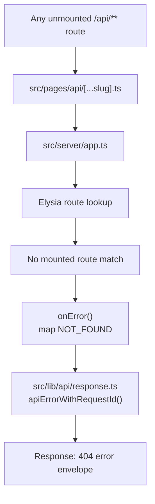

## Planned Endpoint Flows

Planned endpoints still start at the same Astro catch-all. Their route/controller/service/domain/repository files do not exist yet or are not complete. Last node stays `To be implemented`.

Auth recovery and Google OAuth are active endpoint flows above.

### Admin Accounts And Ownership

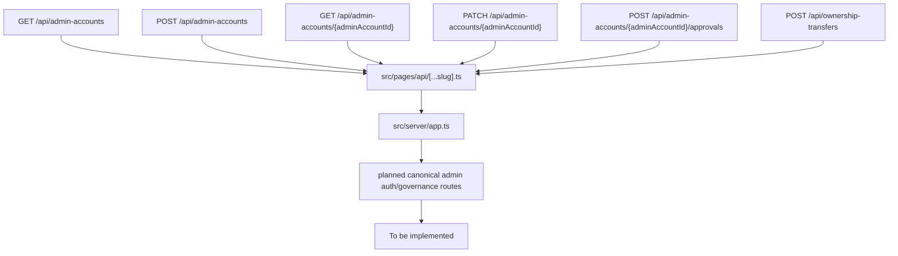

### Brands

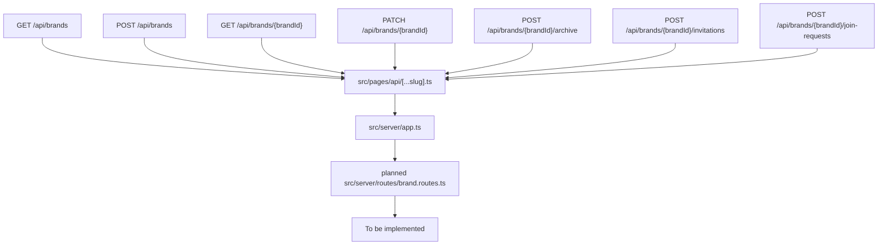

### Products And Categories

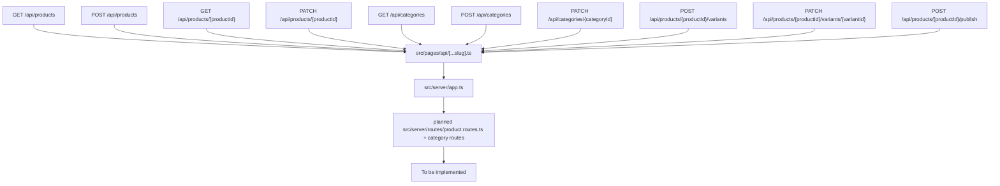

### Product Assets

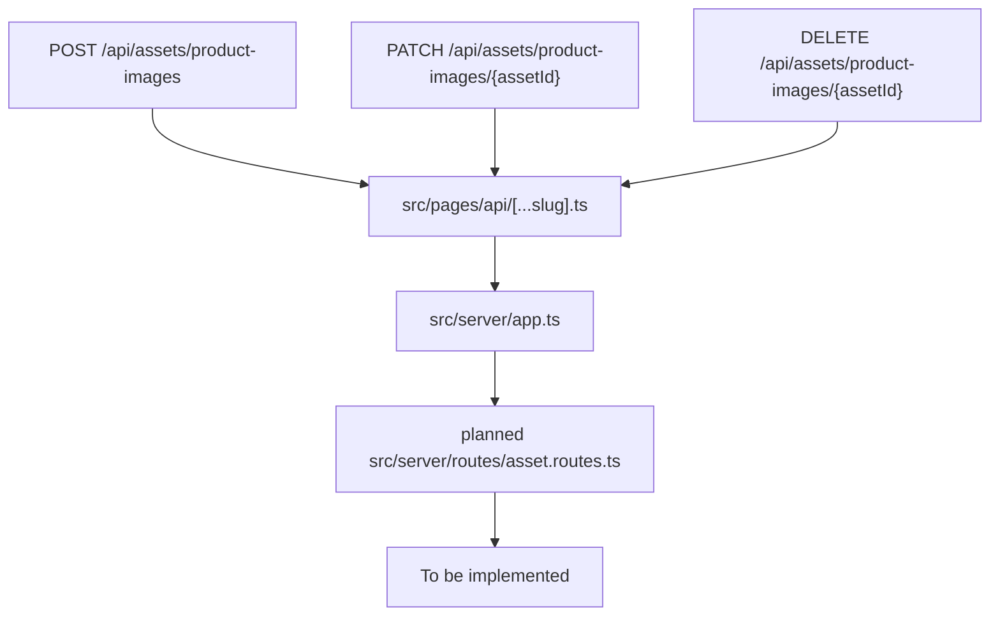

### Checkout

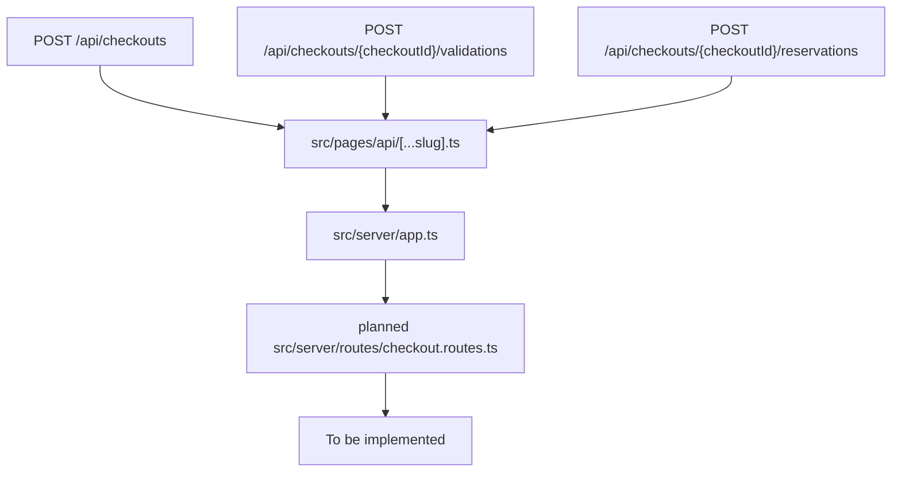

### Payments And Webhooks

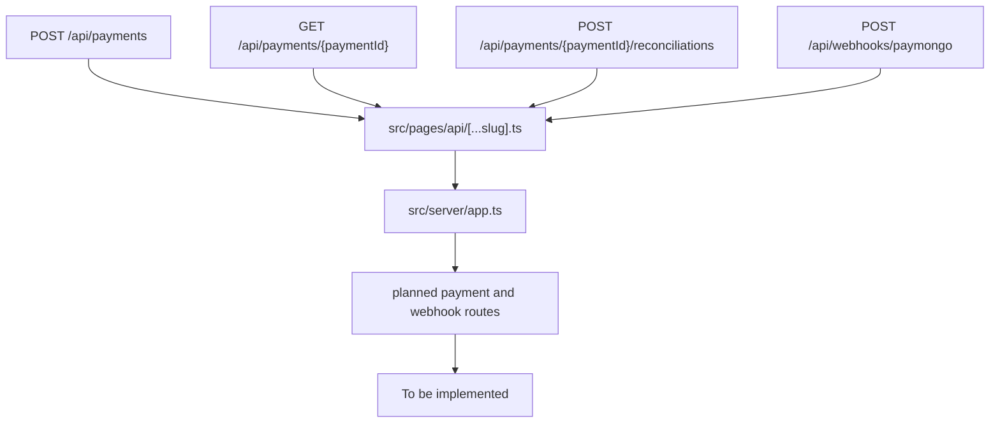

### Orders

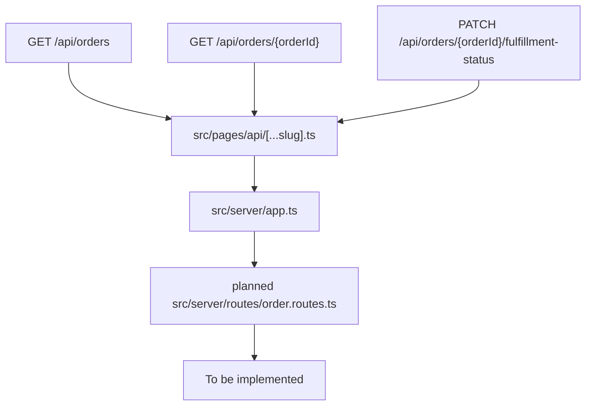

### Returns And Refunds

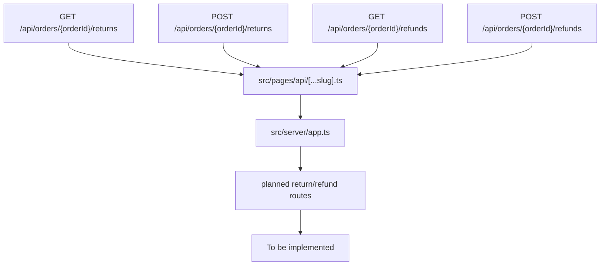

### Audit And Activity

```mermaid
flowchart TD
  A["GET /api/audit-events"] --> X["src/pages/api/[...slug].ts"]
  B["GET /api/activity-history"] --> X
  X --> Y["src/server/app.ts"]
  Y --> Z["planned src/server/routes/audit.routes.ts"]
  Z --> T["To be implemented"]
```
