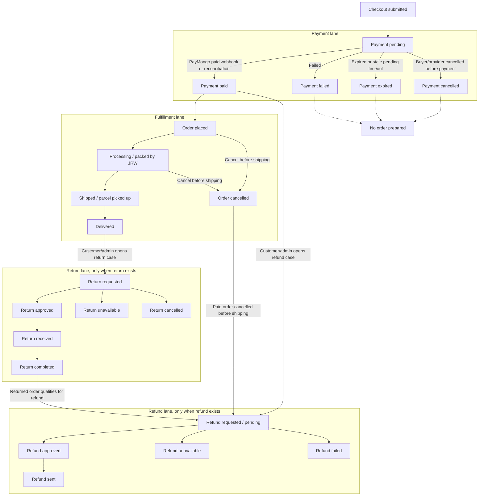

# JRW Order Status Flow

Customer-facing order status is shown as a newest-first timeline. Backoffice should keep payment, fulfillment, return, and refund as separate lanes, then project safe customer labels from those lanes.

Idle return and refund values are not process steps. `RETURN_NOT_REQUESTED` and `REFUND_NOT_REQUESTED` mean there is no active case, so they must not point to "requested" in the flow.

## Customer Timeline Projection

- Latest meaningful event appears first.
- Raw database values such as `PAYMENT_PAID` and `ORDER_PLACED` do not render in customer UI.
- Default inactive lanes such as "No return requested" and "No refund requested" stay out of the main timeline and out of the process arrows.
- Item display uses `order_snapshots` only; current catalog data must not rewrite historical order truth.

## Cancellation Rules

- Payment cancelled, failed, or expired before payment means no fulfillment is prepared and no refund is needed.
- Order cancelled after payment is paid means fulfillment stops and a refund case should be opened.
- Order cannot normally be cancelled after shipping; customer path becomes return support instead.
